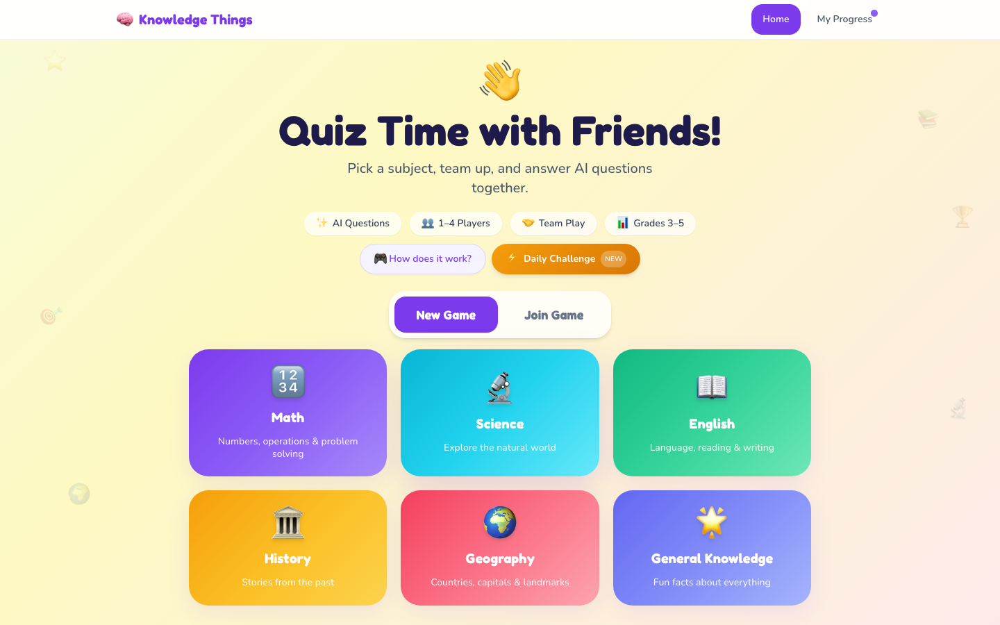
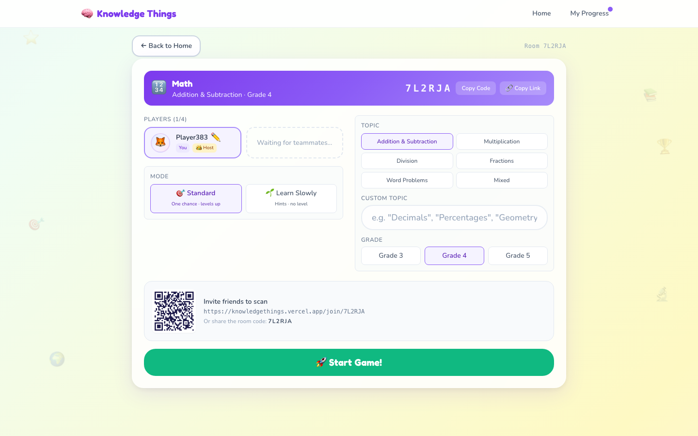
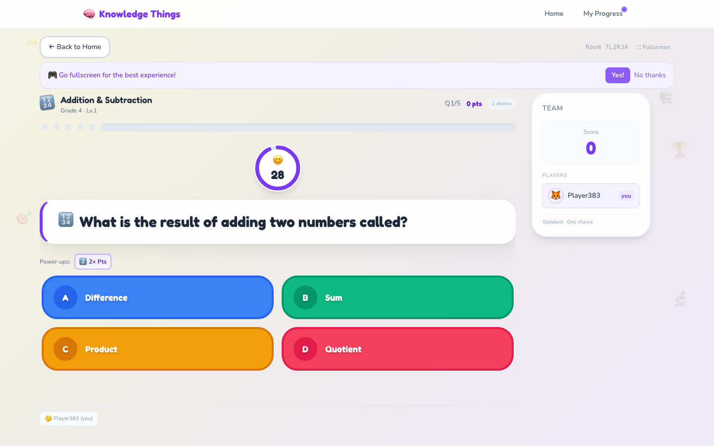

# Knowledge Things

A cooperative multiplayer quiz game for kids in Grades 3-5. Pick a subject, share a room code, and answer AI-generated questions as a team.

[](https://knowledgethings.vercel.app/)
[](https://www.typescriptlang.org/)
[](https://nextjs.org/)
[](https://socket.io/)
[](https://tailwindcss.com/)
[](https://www.framer.com/motion/)
[](https://jestjs.io/)
[](https://playwright.dev/)

**[knowledgethings.vercel.app](https://knowledgethings.vercel.app/)**

---

## Screenshots

| Home | Game Room Setup |
|---|---|
|  |  |



---

## What it does

Up to 4 players join a room using a short code, choose a subject and topic, then answer questions together. Everyone shares the same score. Questions are pulled from the DeepSeek AI API and adapt to how well the team is doing.

- 6 subjects: Math, Science, English, History, Geography, General Knowledge
- Adaptive difficulty: 3 correct in a row makes questions harder, 2 wrong makes them easier
- 30-second timer per question, server-enforced
- Two modes: **Standard** (tracks progress and level) and **Learn Slowly** (shows hints, no saving)
- Streaks, power-ups, badges, and a level system per subject to keep kids coming back
- No login needed. Profiles are tied to the device so kids can just pick a nickname and go.

---

## Architecture


All game logic runs in `engine.ts` on the backend. The socket handlers in `handlers.ts` only move data in and out. This keeps the game state predictable and easy to test.

| Decision | Why |
|----------|-----|
| All state in `engine.ts` | Handlers stay thin, no split-brain bugs across socket events |
| No database | JSON file persistence is enough for a session game, keeps deployment simple |
| One AI call per game | Fetch all questions upfront and serve from memory, no per-question delay |
| Device token auth | Kids don't have email addresses, so login would just be friction |

---

## Tech Stack

| Layer | Technology |
|-------|------------|
| Frontend | Next.js 14 (App Router), TypeScript, Tailwind CSS, Framer Motion |
| Backend | Node.js, Express, Socket.io, TypeScript |
| AI | DeepSeek API with local question fallback |
| Testing | Jest (unit tests), Playwright (end-to-end) |
| State | In-memory rooms with JSON file persistence |

---

## Running locally

### Prerequisites

- Node.js 18+
- npm 9+

### Install

```bash
cd backend && npm install
cd frontend && npm install
```

### Environment setup

Copy `backend/.env.example` to `backend/.env`. The only variable is `DEEPSEEK_API_KEY`, which is optional. If you leave it blank the app falls back to local questions.

The frontend needs no environment changes for local dev.

### Start

```bash
# Terminal 1
cd backend && npm run dev

# Terminal 2
cd frontend && npm run dev
```

Open [http://localhost:3000](http://localhost:3000). To test multiplayer, open a second browser tab and join with the room code.

---

## Tests

### Unit tests

```bash
cd backend
npm test
npm run test:coverage
```

Covers scoring, difficulty adaptation, badge logic, question generation, and progress persistence.

### End-to-end tests

Both servers need to be running first.

```bash
cd frontend
npx playwright install   # first time only
npm run e2e
npm run e2e:ui           # opens the interactive Playwright UI
```

---

## Project structure

```
backend/
  src/
    config/constants.ts        game constants (timers, scoring, thresholds)
    game/engine.ts             core game logic: scoring, questions, level progression
    game/achievements.ts       lifetime achievement rules
    game/badges.ts             per-session badge rules
    services/openaiService.ts  DeepSeek API client + local fallback
    socket/handlers.ts         all Socket.io event handlers
    socket/middleware.ts       origin check and rate limiting
    store/progressStore.ts     group progress saved to JSON
    store/profileStore.ts      per-user profiles saved to JSON
    routes/rooms.ts            REST endpoint: check if a room exists
    index.ts                   server entry point
    types.ts                   shared TypeScript types
  tests/                       Jest test suites

frontend/
  app/
    page.tsx                   home page with subject picker
    room/[roomId]/page.tsx     the actual game page
    profile/page.tsx           profile, achievements, game history
    context/GameContext.tsx    global state shared across components
  components/                  GameScreen, WaitingRoom, SessionSummary, etc.
  hooks/useSocket.ts           Socket.io connection and event handling
  utils/                       subjects, types, API client
  e2e/                         Playwright tests
```

---

## Scoring

- 10 points per correct answer
- Streak bonuses: 20 pts at 3x, 30 pts at 5x, 50 pts at 10x
- All players answer correctly: +25 bonus
- Everyone answers in under 15 seconds: +15 speed bonus
- Stars at the end: `round(teamScore / maxPossible * 5)`
- 4+ stars in Standard mode levels up that subject (max level 10)
- Questions per game scale with level: `min(14, max(5, 4 + level))`

---

## License

MIT
