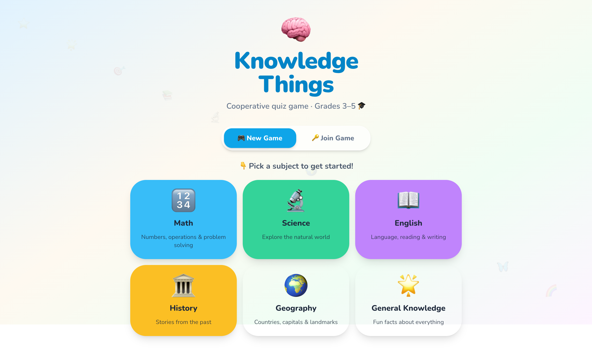
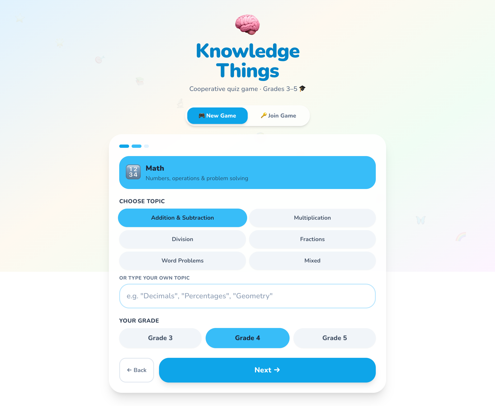
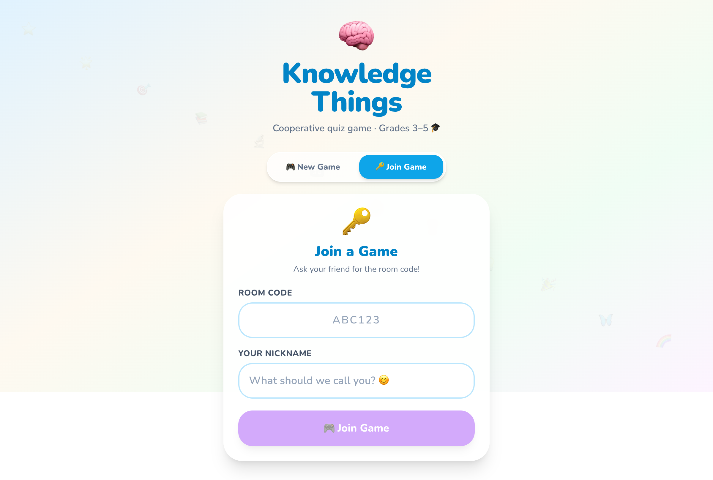
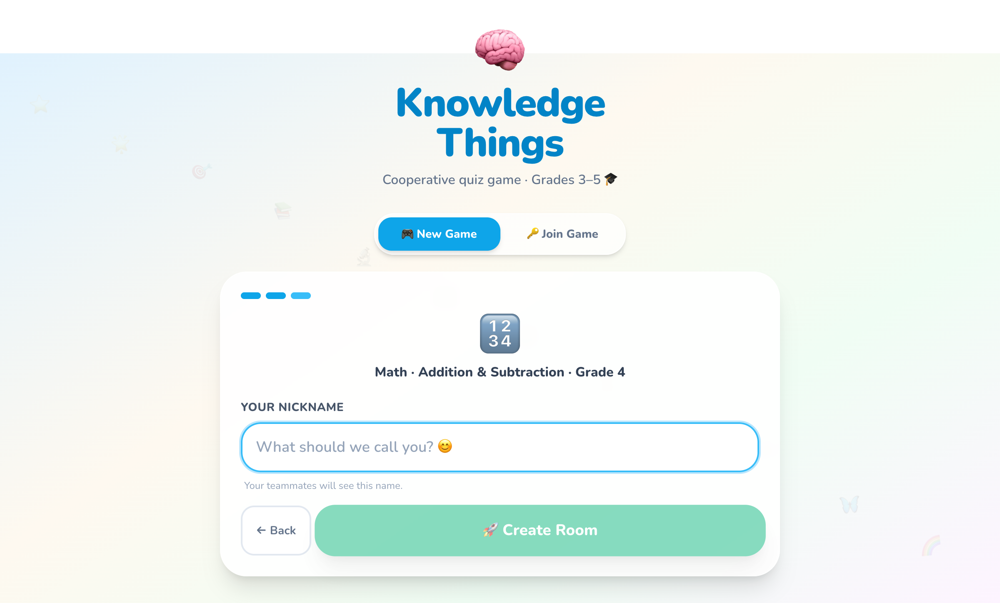
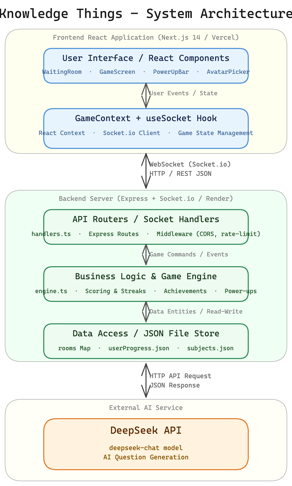

# Knowledge Things

> A cooperative real-time multiplayer quiz game for kids in Grades 3–5, powered by AI-generated questions and built with Next.js + Socket.io.

[](https://www.typescriptlang.org/)
[](https://nextjs.org/)
[](https://socket.io/)
[](https://tailwindcss.com/)
[](https://www.framer.com/motion/)
[](https://jestjs.io/)
[](https://playwright.dev/)

---

## Overview

Knowledge Things lets 1–4 players share a room code, pick a subject and grade level, then race through AI-generated questions together. Points are earned as a team — every correct answer counts for everyone.

| | |
|---|---|
|  |  |
|  |  |

---

## Features

**Gameplay**
- 6 subjects: Math, Science, English, History, Geography, General Knowledge
- AI-generated questions via DeepSeek API (local fallback if API is unavailable)
- Adaptive difficulty — 3 consecutive correct answers → harder; 2 wrong → easier
- 30-second server-side timer per question with auto-advance
- Two modes: **Standard** (saves progress) and **Learn Slowly** (hints, no save)

**Multiplayer**
- Create a room → share a 4-character code → others join instantly
- Up to 4 players, synchronized in real time via Socket.io
- Cooperative team score, individual streaks, and power-ups

**Progression & Rewards**
- Per-user profiles stored locally (no login required — device token only)
- 14 lifetime achievements + 8 per-session badges
- 3 power-ups earned through gameplay (Skip, Shield, Double Points)
- Level system per subject (Levels 1–10), unlocked by earning 4+ stars

**Accessibility & UX**
- Designed for ages 8–11: large touch targets, friendly language
- `prefers-reduced-motion` respected throughout
- PWA-ready (installable on mobile, works offline for static assets)
- Framer Motion animations with graceful degradation

---

## Architecture



### Key design decisions

| Decision | Rationale |
|----------|-----------|
| All game state lives in `engine.ts` | Handlers are pure I/O — prevents split-brain bugs across socket events |
| No database | JSON file persistence is sufficient for a cooperative session game; simplifies deployment |
| One AI call per game | Batch-fetch all questions upfront, serve from memory — no per-question latency |
| Device token auth | Kids don't have email addresses; persistent profiles without login friction |

---

## Tech Stack

| Layer | Technology |
|-------|------------|
| Frontend | Next.js 14 (App Router), TypeScript, Tailwind CSS, Framer Motion |
| Backend | Node.js, Express, Socket.io, TypeScript |
| AI | DeepSeek API (OpenAI-compatible) with local fallback |
| Testing | Jest (unit), Playwright (E2E) |
| State | In-memory rooms + JSON file persistence |

---

## Getting Started

### Prerequisites

- Node.js 18+
- npm 9+

### Install dependencies

```bash
# Backend
cd backend && npm install

# Frontend
cd frontend && npm install
```

### Environment variables

**Backend** — copy `backend/.env.example` to `backend/.env`:

```
DEEPSEEK_API_KEY=   # Optional. Omit to use local fallback questions.
```

**Frontend** — copy `frontend/.env.example` to `frontend/.env.local` (no changes needed for local dev).

### Run locally

```bash
# Terminal 1 — Backend (port 3001)
cd backend && npm run dev

# Terminal 2 — Frontend (port 3000)
cd frontend && npm run dev
```

Open [http://localhost:3000](http://localhost:3000). Create a game, share the room code, and join from another browser tab or device.

---

## Testing

### Backend unit tests (Jest)

```bash
cd backend
npm test
npm run test:coverage   # with coverage report
```

Covers: game engine scoring, difficulty adaptation, badge logic, question generation fallback, progress persistence.

### End-to-end tests (Playwright)

With both servers running:

```bash
cd frontend
npx playwright install   # one-time browser setup
npm run e2e              # headless
npm run e2e:ui           # interactive mode
```

E2E suite covers: create room → join → start game → answer question flow.

---

## Project Structure

```
knowledge-things/
├── backend/
│   ├── src/
│   │   ├── config/constants.ts       # Tuneable game constants
│   │   ├── game/
│   │   │   ├── engine.ts             # Scoring, validation, level progression
│   │   │   ├── achievements.ts       # Lifetime achievement logic
│   │   │   └── badges.ts             # Per-session badge logic
│   │   ├── services/
│   │   │   ├── openaiService.ts      # DeepSeek API + local fallback
│   │   │   └── questionPoolService.ts
│   │   ├── socket/
│   │   │   ├── handlers.ts           # All Socket.io event handlers
│   │   │   └── middleware.ts         # Origin check + rate limiting
│   │   ├── store/
│   │   │   ├── progressStore.ts      # Group progress → JSON
│   │   │   └── profileStore.ts       # Per-user profiles → JSON
│   │   ├── routes/rooms.ts           # REST: room-exists check
│   │   ├── index.ts                  # Server entry point
│   │   └── types.ts                  # Shared TypeScript types
│   └── tests/                        # Jest test suites
│
└── frontend/
    ├── app/
    │   ├── page.tsx                  # Home: subject + topic wizard
    │   ├── room/[roomId]/page.tsx    # Main game page
    │   ├── profile/page.tsx          # User profile + achievements
    │   └── context/GameContext.tsx   # Global game state
    ├── components/                   # GameScreen, WaitingRoom, SessionSummary, …
    ├── hooks/useSocket.ts            # Socket.io connection layer
    ├── utils/                        # Subjects, types, API client, achievements
    └── e2e/                          # Playwright tests
```

---

## Game Logic Highlights

- **Questions per game:** `min(14, max(5, 4 + gameLevel))` — scales with player skill
- **Scoring:** 10 pts correct + streak bonuses (20 / 30 / 50 pts) + all-correct bonus (25 pts) + speed bonus (15 pts if all answer in < 15 s)
- **Stars:** `round(teamScore / maxPossible × 5)` — 0–5 stars per session
- **Level up:** 4+ stars in Standard mode advances subject level (max 10)

---

## License

MIT
